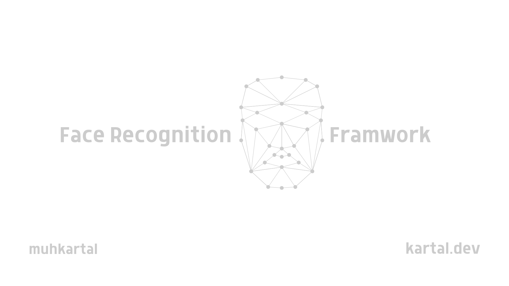

# FR-Framework

<div align="center">



[](https://opensource.org/licenses/MIT)
[](https://www.python.org/downloads/)
[](https://www.docker.com/)
[](https://fastapi.tiangolo.com/)
[](docs/index.md)
[](https://github.com/psf/black)

**A comprehensive, modular face recognition framework**

[Demo](#demo) • [Features](#key-features) • [Installation](#installation) • [Quick Start](#quick-start) • [Documentation](docs/index.md) • [API](#api-reference)

</div>

## Overview

FR-Framework is a powerful, modular toolkit for face recognition tasks, offering everything from basic face detection to advanced facial analytics. Built with flexibility and performance in mind, it provides a complete solution for developers, researchers, and enterprises working with facial recognition technology.

## Key Features

-  **Modular Architecture**: Use only the components you need
-  **Multiple Detection Models**: Support for both HOG (CPU) and CNN (GPU) detection models
-  **Facial Landmark Detection**: Identify and track 68 facial landmarks
-  **Face Analysis**: Blur detection, head pose estimation, eye aspect ratio analysis
-  **Real-time Processing**: Live camera feed integration
-  **Video Processing**: Analyze video files with detailed timeline results
-  **REST API**: Easy integration with other applications via a comprehensive API
-  **Docker Support**: Simple deployment in containers
-  **Extensive Documentation**: Tutorials, API references, and examples

## Performance Benchmarks

| Model     | Speed (ms/image) | Accuracy | Platform          |
| --------- | ---------------- | -------- | ----------------- |
| HOG (CPU) | 31.2             | 97.1%    | Core i7, 16GB RAM |
| CNN (CPU) | 121.5            | 99.3%    | Core i7, 16GB RAM |
| CNN (GPU) | 8.7              | 99.3%    | NVIDIA RTX 3080   |

\*Benchmarks based on 1080p images with varying numbers of faces

## Components

| Module      | Description                                       |
| ----------- | ------------------------------------------------- |
| fr-photo    | Photo-based face detection and recognition        |
| fr-landmark | Facial landmark detection                         |
| fr-analyze  | Face analysis (blur detection, orientation, etc.) |
| fr-live     | Real-time face recognition from camera feed       |
| fr-video    | Video processing for face recognition             |
| fr-system   | Core system functionality (coming soon)           |

## Comparison with Other Libraries

| Feature           | FR-Framework  | face_recognition | OpenCV         | dlib          |
| ----------------- | ------------- | ---------------- | -------------- | ------------- |
| Face Detection    | ✓ (HOG & CNN) | ✓ (HOG & CNN)    | ✓ (Haar & DNN) | ✓ (HOG)       |
| Facial Landmarks  | ✓ (68 points) | ✓ (68 points)    | ✓ (limited)    | ✓ (68 points) |
| Face Recognition  | ✓             | ✓                | ✓ (limited)    | ✓ (limited)   |
| Face Analysis     | ✓ (extensive) | ✗                | ✓ (limited)    | ✗             |
| Real-time Support | ✓             | ✗                | ✓              | ✓ (limited)   |
| Video Processing  | ✓             | ✗                | ✓              | ✗             |
| REST API          | ✓             | ✗                | ✗              | ✗             |
| Docker Support    | ✓             | ✗                | ✗              | ✗             |
| Modular Design    | ✓             | ✗                | ✗              | ✗             |
| Python Support    | ✓             | ✓                | ✓              | ✓             |

## Real-World Use Cases

-  **Security Systems**: Face-based authentication and access control
-  **Attendance Systems**: Automatic tracking in educational or workplace settings
-  **Photo Cataloging**: Organizing media libraries by detected individuals
-  **Video Analytics**: Analyzing customer demographics and engagement
-  **Health Monitoring**: Detecting fatigue or attention levels through eye tracking
-  **User Experience**: Adaptive interfaces based on user attention and engagement

## Installation

### Standard Installation

```bash
# Clone the repository
git clone https://github.com/yourusername/FR-Framework.git
cd FR-Framework

# Install dependencies
pip install -r requirements.txt

# Install the package in development mode
pip install -e .
```

### Docker Installation

```bash
# Build and start the services
docker-compose up -d

# Or just the API service
docker-compose up -d fr-api
```

For more details on Docker deployment, see [DOCKER.md](DOCKER.md).

## Quick Start

### Complete Workflow Example

```python
import cv2
from fr_framework import preprocess_image, detect_faces, detect_landmarks, analyze_face

# 1. Load and preprocess the image
image_path = "path/to/group_photo.jpg"
face_image = preprocess_image(image_path)

# 2. Detect faces
detections = detect_faces(face_image, model_type="hog")
print(f"Found {len(detections)} faces")

# 3. Detect landmarks for each face
landmarks = detect_landmarks(face_image, detections)

# 4. Analyze each face
results = []
for i, (detection, landmark) in enumerate(zip(detections, landmarks)):
    # Analyze the face
    analysis = analyze_face(face_image, detection, landmark)

    # Store results
    results.append({
        "face_id": i,
        "position": detection.bbox,
        "blur_score": analysis["blur_score"],
        "brightness": analysis["brightness"],
        "head_pose": analysis["head_pose"],
        "eyes_closed": analysis.get("eyes_closed", None)
    })

# 5. Visualize results
image = cv2.imread(image_path)

for i, (detection, result) in enumerate(zip(detections, results)):
    top, right, bottom, left = detection.bbox

    # Draw bounding box
    cv2.rectangle(image, (left, top), (right, bottom), (0, 255, 0), 2)

    # Add face ID
    cv2.putText(image, f"Face #{i}", (left, top - 10),
                cv2.FONT_HERSHEY_SIMPLEX, 0.5, (0, 255, 0), 2)

    # Add analysis info
    blur_text = f"Blur: {result['blur_score']:.1f}"
    pose_text = f"Yaw: {result['head_pose']['yaw']:.1f}"

    cv2.putText(image, blur_text, (left, bottom + 15),
                cv2.FONT_HERSHEY_SIMPLEX, 0.5, (255, 0, 0), 1)
    cv2.putText(image, pose_text, (left, bottom + 35),
                cv2.FONT_HERSHEY_SIMPLEX, 0.5, (255, 0, 0), 1)

# Save or display the result
cv2.imwrite("output.jpg", image)
cv2.imshow("Face Analysis", image)
cv2.waitKey(0)
cv2.destroyAllWindows()
```

### Using Docker & API

```bash
# Start the Docker container
docker-compose up -d fr-api

# Use curl to detect faces in an image
curl -X POST "http://localhost:8000/detect" \
  -H "accept: application/json" \
  -H "Content-Type: multipart/form-data" \
  -F "file=@path/to/image.jpg" \
  -F "model_type=hog" \
  -F "return_image=true"
```

```python
# Using the Python client library
from fr_framework.api.client import FRApiClient

# Create an API client
client = FRApiClient("http://localhost:8000")

# Detect faces in an image
result = client.detect_faces("path/to/image.jpg", return_image=True)
print(f"Detected {result['num_faces']} faces")

# Get the face locations
for face in result["faces"]:
    print(f"Face at: {face['bbox']}")
    print(f"Confidence: {face['confidence']}")
```

For more examples, see the [Tutorials](docs/tutorials) and [Examples](docs/examples) sections.

## API Reference

The FR-Framework provides a comprehensive REST API for integration with other applications:

-  `POST /detect` - Detect faces in an image
-  `POST /landmarks` - Detect facial landmarks
-  `POST /analyze` - Analyze facial attributes
-  `POST /video` - Process a video file

For detailed API documentation, run the API server and visit:

-  Swagger UI: `http://localhost:8000/docs`
-  ReDoc: `http://localhost:8000/redoc`

## Documentation

-  [API Reference](docs/api/index.md)
-  [Tutorials](docs/tutorials)
-  [Examples](docs/examples)
-  [Docker Guide](DOCKER.md)

## System Architecture

<div align="center">
  
</div>

FR-Framework is designed with modularity and extensibility in mind:

1. **Core Modules**: Specialized components for different face recognition tasks
2. **Common Utilities**: Shared functionality across all modules
3. **API Layer**: RESTful interface for external applications
4. **Docker Containers**: Isolated deployment environments
5. **Client Libraries**: Easy integration with other systems

## Requirements

### Minimum Requirements

-  Python 3.7+
-  OpenCV 4.5+
-  dlib 19.22+
-  face_recognition 1.3+
-  NumPy 1.19+
-  SciPy 1.6+

### For API Server

-  FastAPI 0.68+
-  Uvicorn 0.15+
-  Python-multipart 0.0.5+
-  Pydantic 1.8+

### For Docker Deployment

-  Docker 20.10+
-  Docker Compose 2.0+

## Contributing

Contributions are welcome! Please feel free to submit a Pull Request.

1. Fork the repository
2. Create your feature branch (`git checkout -b feature/amazing-feature`)
3. Commit your changes (`git commit -m 'Add some amazing feature'`)
4. Push to the branch (`git push origin feature/amazing-feature`)
5. Open a Pull Request

### Development Setup

```bash
# Clone the repository
git clone https://github.com/yourusername/FR-Framework.git
cd FR-Framework

# Create a virtual environment
python -m venv venv
source venv/bin/activate  # On Windows: venv\Scripts\activate

# Install dependencies
pip install -r requirements.txt
pip install -e .

# Install development dependencies
pip install pytest black flake8

# Run tests
pytest

# Format code
black .
```

## License

This project is licensed under the MIT License - see the [LICENSE](LICENSE) file for details.

## Acknowledgments

-  [face_recognition](https://github.com/ageitgey/face_recognition) library for core recognition algorithms
-  [dlib](http://dlib.net/) for face detection and landmark detection
-  [OpenCV](https://opencv.org/) for image processing functionality
-  [FastAPI](https://fastapi.tiangolo.com/) for the API implementation

## Contact

-  Project Link: [https://github.com/yourusername/FR-Framework](https://github.com/muhkartal/FR-Framework)
-  Developer Website: [https://kartal.dev/m](https://kartal.dev/m)

---

<div align="center">
<p>If you find FR-Framework helpful, please consider giving it a star ⭐</p>
</div>
